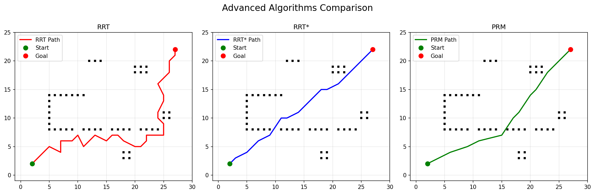
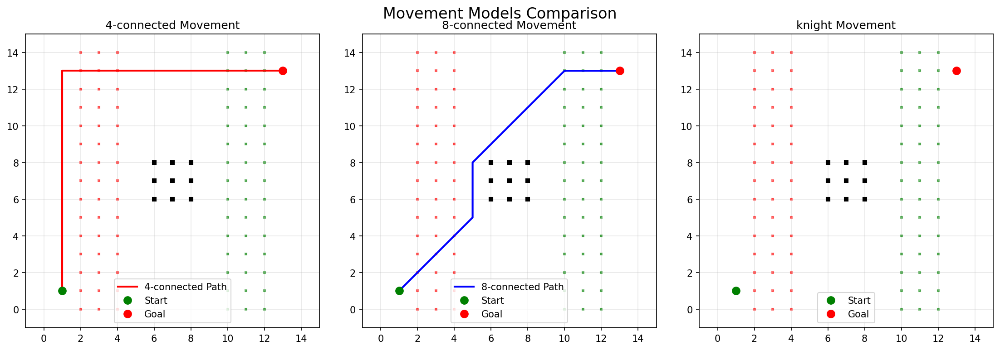
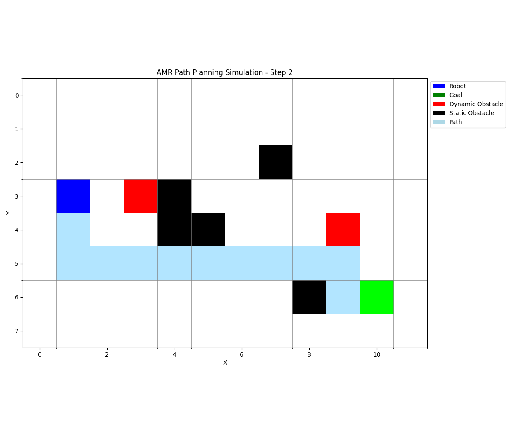

# Autonomous Mobile Robot Path Planner

A comprehensive Python package for autonomous mobile robot (AMR) path planning with dynamic obstacle avoidance and real-time simulation capabilities.

## Features

- **Multiple Search Algorithms**: Dijkstra and A* implementations
- **Dynamic Obstacle Handling**: Real-time obstacle movement and collision avoidance
- **Grid-based Navigation**: 4-connected grid map representation
- **Real-time Visualization**: Matplotlib-based simulation with animation
- **Modular Design**: Clean, extensible architecture
- **Comprehensive Testing**: Full test suite with pytest

## Installation

1. Clone the repository:
```bash
git clone https://github.com/aksh-ay06/Autonomous-Mobile-Robot-Path-Planner
cd Autonomous-Mobile-Robot-Path-Planner
```

2. Install dependencies:
```bash
pip install -r requirements.txt
```

3. Install the package in development mode:
```bash
pip install -e .
```

## ⚡️ Quick Start (Updated)

```python
from amr_path_planner import GridMap, PathPlanner, RobotAgent, DynamicObstacleMgr, Simulator

# Create a 20x15 grid with some obstacles
grid = GridMap(20, 15, {(5, 5), (10, 8), (15, 12)})

# Create path planner using A* algorithm
planner = PathPlanner('astar', grid=grid)

# Create robot agent
robot = RobotAgent((1, 1), planner)
robot.plan_to((18, 13))

# Create dynamic obstacle manager
obstacle_mgr = DynamicObstacleMgr(grid)
obstacle_mgr.add_obstacle(8, 6)
obstacle_mgr.add_obstacle(12, 10)

# Create and run simulator (use keyword arguments for clarity)
simulator = Simulator(grid=grid, agent=robot, obstacle_mgr=obstacle_mgr)
simulator.run(visualize=True)
```

## Architecture

The package consists of several key components:

### Core Modules

- **`GridMap`**: 2D grid representation with obstacle handling
- **`PathPlanner`**: Unified interface for search algorithms
- **`RobotAgent`**: Robot logic with path following and replanning
- **`DynamicObstacleMgr`**: Dynamic obstacle management with random movement
- **`Simulator`**: Main simulation loop with visualization

### Search Algorithms

- **Dijkstra**: Optimal pathfinding algorithm
- **A***: Heuristic-based optimal pathfinding (faster than Dijkstra)

## Usage Examples

### Basic Path Planning

```python
from amr_path_planner import GridMap, dijkstra, astar

# Create grid and find path
grid = GridMap(10, 10, {(3, 3), (4, 4)})
path = dijkstra((0, 0), (9, 9), grid)
print(f"Path length: {len(path)}")
```

### Advanced Simulation

```python
# Create environment
grid = GridMap(15, 10)
planner = PathPlanner('astar', grid=grid)
robot = RobotAgent((0, 0), planner)

# Add dynamic obstacles
obstacle_mgr = DynamicObstacleMgr(grid, movement_probability=0.7)
for i in range(5):
    obstacle_mgr.spawn_random_obstacles(1)

# Run simulation
robot.plan_to((14, 9))
simulator = Simulator(grid, robot, obstacle_mgr, max_steps=200)
simulator.run(visualize=True, save_gif=True, gif_filename="simulation.gif")
```

## Demo Script

Run the included demo to see the system in action:

```bash
cd examples
python demo.py
```

The demo creates a complex environment with:
- Static obstacles (walls and barriers)
- Dynamic obstacles with random movement
- Robot navigation from start to goal
- Real-time visualization

## Testing

Run the test suite:

```bash
pytest tests/
```

Run tests with coverage:

```bash
pytest tests/ --cov=amr_path_planner
```

## Performance Metrics

Typical performance on a modern machine:
- **Grid Size**: Handles grids up to 100x100 efficiently
- **Path Planning**: A* typically 2-3x faster than Dijkstra
- **Real-time Performance**: 10-20 FPS visualization
- **Memory Usage**: O(grid_size) memory complexity

## Configuration Options

### PathPlanner Configuration
```python
# Use Dijkstra algorithm
planner = PathPlanner('dijkstra')

# Use A* with custom heuristic
def custom_heuristic(pos1, pos2):
    return abs(pos1[0] - pos2[0]) + abs(pos1[1] - pos2[1])

planner = PathPlanner('astar', heuristic=custom_heuristic)
```

### Dynamic Obstacle Configuration
```python
# High movement probability (more dynamic)
obstacle_mgr = DynamicObstacleMgr(grid, movement_probability=0.9)

# Low movement probability (more static)
obstacle_mgr = DynamicObstacleMgr(grid, movement_probability=0.3)
```

### Simulation Configuration
```python
# Fast simulation
simulator = Simulator(grid, robot, obstacle_mgr, step_delay=0.05)

# Detailed visualization
simulator = Simulator(grid, robot, obstacle_mgr, step_delay=0.5, max_steps=1000)
```

## Advanced Features

### Sampling-Based Algorithms

- **RRT (Rapidly-exploring Random Tree)**: Fast, sampling-based planner for complex environments
- **RRT\***: Optimized RRT with path cost minimization
- **PRM (Probabilistic Roadmap)**: Multi-query roadmap planner for static environments

Example usage:
```python
from amr_path_planner.advanced_algorithms import rrt, rrt_star, prm

# Plan with RRT
path = rrt(start=(0, 0), goal=(19, 14), grid=grid, max_iterations=1000, step_size=1.0)

# Plan with RRT*
path = rrt_star(start=(0, 0), goal=(19, 14), grid=grid, max_iterations=1000, step_size=1.0, search_radius=2.0)

# Plan with PRM
path = prm(start=(0, 0), goal=(19, 14), grid=grid, num_samples=200, connection_radius=3.0)
```

### Path Smoothing

- **Shortcut Smoothing**: Removes unnecessary waypoints
- **Bezier Smoothing**: Smooths path using Bezier curves
- **Spline Smoothing**: (Requires scipy) Smooths path with splines
- **Adaptive Smoothing**: Preserves sharp turns, smooths elsewhere
- **Douglas-Peucker**: Simplifies path with minimal deviation

Example usage:
```python
from amr_path_planner.path_smoothing import shortcut_smoothing, bezier_smoothing, smooth_path, analyze_path_smoothness

smoothed = shortcut_smoothing(path, grid)
bezier = bezier_smoothing(path, num_points=50)
adaptive = smooth_path(path, grid, method='adaptive')

# Analyze path smoothness
smoothness_metrics = analyze_path_smoothness(path)
print(smoothness_metrics)
```

### Enhanced Grid Movement Models

- **4-connected**: Up, down, left, right
- **8-connected**: Includes diagonals
- **Custom patterns**: (e.g., knight moves)

Example usage:
```python
from amr_path_planner.enhanced_grid import EnhancedGridMap, MovementType

grid = EnhancedGridMap(20, 20, movement_model=MovementType.EIGHT_CONNECTED)
# For custom moves:
grid.movement_model = MovementType.CUSTOM
# Example: knight moves
grid.custom_moves = [(2, 1), (1, 2), (-1, 2), (-2, 1), (-2, -1), (-1, -2), (1, -2), (2, -1)]
```

## Running Demos & Benchmarks

- **Demo:**
  ```bash
  cd examples
  python demo.py
  ```
- **Benchmark:**
  ```bash
  cd examples
  python performance_benchmark.py
  ```

## Troubleshooting & Best Practices

- **Simulator Instantiation:** Always use keyword arguments (e.g., `Simulator(grid=..., agent=..., obstacle_mgr=...)`) to avoid argument misplacement errors.
- **Advanced Algorithms:** Use the function-based interface (`rrt`, `rrt_star`, `prm`) as shown above.
- **Missing Attributes:** If you see errors like `AttributeError: 'Simulator' object has no attribute 'running'`, ensure your code and package are up to date.
- **Visualization Warnings:** Some matplotlib warnings may appear but do not affect simulation results.
- **Import Errors:** Make sure to install the package in editable mode: `pip install -e .`

## API Reference

See the docstrings in each module for detailed API documentation. Key classes:

- `GridMap(width, height, static_obstacles=None)`
- `PathPlanner(algorithm='astar', heuristic=None, grid=None)`
- `RobotAgent(start_position, planner)`
- `DynamicObstacleMgr(grid, initial_obstacles=None, movement_probability=0.7)`
- `Simulator(grid, agent, obstacle_mgr, step_delay=0.1, max_steps=1000)`

## Advanced Algorithm Example



_Example output of the advanced algorithm Demo._


## Integrated Feature Demo


_Example output for integrated feature Demo._


## Movement Models Demo



_Example output for Movement Models Demo._

## Path Smoothing Demo


_Example output for Path Smoothing Demo._


## Performance Benchmark Example


_Example output of the performance benchmark script._

## AMR Demo 1 Robot

